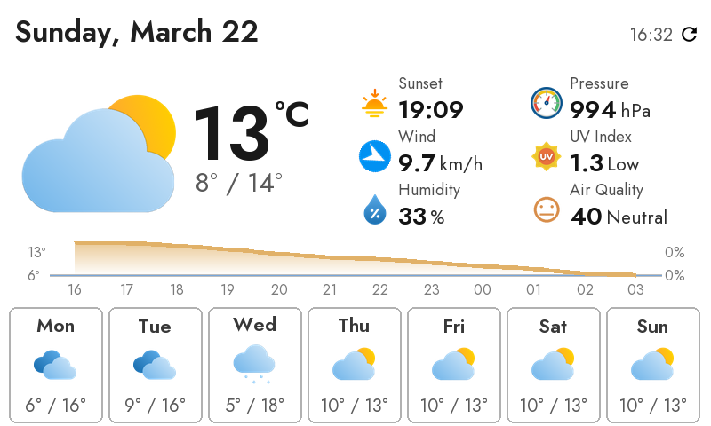
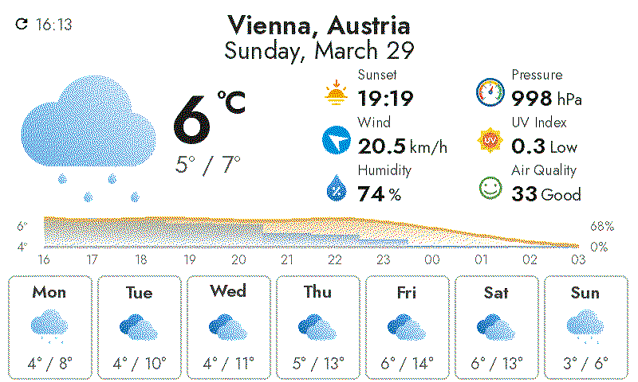
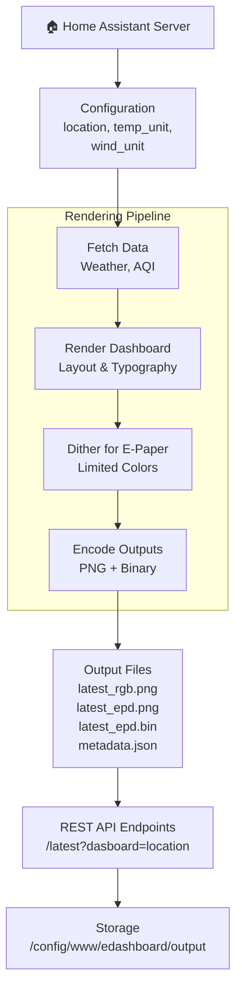
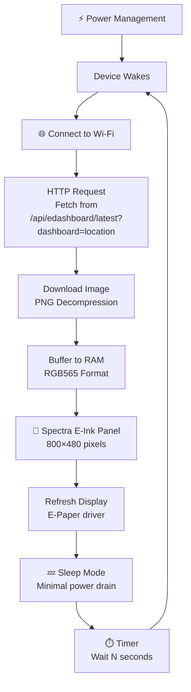

# eDashboard

[![HACS][hacs-shield]][hacs]
[![License][license-shield]](LICENSE)
[![Project Maintenance][maintenance-shield]][maintenance]

Home Assistant custom component that generates dashboard images and EDB7 binary payloads for and ESPHome client running on a reTerminal 1002 board.

## Project Layout

- `custom_components/edashboard/`
- `README.md`

## Home Assistant Custom Component

This repository now includes a Home Assistant custom component in `custom_components/edashboard/`.
It runs the same backend renderer pipeline from Home Assistant and exposes endpoints for ESPHome/reTerminal clients.


## Generated dashboard images

Normal generated image:



Dithered image for e-paper:




## Workflow Diagrams

### Home Assistant Server Side



### ESPHome Client Side (reTerminal E1002)



## Instructions

### 1) Copy/Install the component

Import this repository in HACS as a custom repository, then install eDashboard.

Manual alternative: copy `custom_components/edashboard` into your Home Assistant config directory:

```bash
/config/custom_components/edashboard
```

### 2) Add configuration

In `configuration.yaml`:


```yaml
edashboard:
  refresh_seconds: 300
  location: Vienna, Austria
  temp_unit: C
  wind_unit: km/h
```


### 3) Restart Home Assistant

After restart, the integration automatically generates images/binary at the configured interval.

#### API Endpoint

**GET** `/api/edashboard/latest`

Query parameters:
- `dashboard` (required): Dashboard name derived from location. For "Vienna, Austria", use `?dashboard=vienna` or `?dashboard=weather_vienna`

Returns the dithered PNG image optimized for e-paper displays.

#### Home Assistant Service

**`edashboard.generate_now`**: Trigger immediate dashboard regeneration

Optional parameters:
- `dashboard`: Specific dashboard name to regenerate (if omitted, regenerates all configured dashboards)

#### Output Files

Output files are written to `/config/www/edashboard/output/` by default (or your configured `output_dir`):

- `latest_rgb.png` – Full RGB image (1.2 MB ~ 1.5 MB)
- `latest_epd.png` – Dithered e-paper image, PNG format (300 KB ~ 600 KB)
- `latest_epd.bin` – Compact EDB7-v1 binary format (192 KB exact)
- `metadata.json` – Configuration, location, and generation timestamp

**Multi-Dashboard Mode:** If multiple dashboards are configured, each has its own subdirectory:
```
/config/www/edashboard/output/
  ├── weather_vienna/
  │   ├── latest_rgb.png
  │   ├── latest_epd.png
  │   ├── latest_epd.bin
  │   └── metadata.json
  └── weather_dublin/
      ├── latest_rgb.png
      ├── latest_epd.png
      ├── latest_epd.bin
      └── metadata.json
```

### 4) Flash ESPHome in your reTerminal E1002

Use ESPHome with an example like the one on `/esphome/edashboard.yaml`:

```yaml
substitutions:
  device_name: reterminal_1002
  friendly_name: eDashboard
  image_url: "http://homeassistant.local:8123/api/edashboard/latest?dashboard=vienna"

esphome:
  name: ${device_name}
  friendly_name: ${friendly_name}

esp32:
  board: esp32-s3-devkitc-1
  framework:
    type: esp-idf

wifi:
  ssid: !secret wifi_ssid
  password: !secret wifi_password

http_request:
  verify_ssl: false

spi:
  clk_pin: GPIO7
  mosi_pin: GPIO9

online_image:
  - id: dashboard_image
    url: ${image_url}
    format: png
    type: RGB565
    buffer_size: 65536
    on_download_finished:
      - component.update: epaper_display

display:
  - platform: epaper_spi
    id: epaper_display
    model: Seeed-reTerminal-E1002
    update_interval: never
    lambda: |-
      it.image(0, 0, id(dashboard_image));
```


## Acknowledgements

Inspired by and grateful to the [InkyPi](https://github.com/fatihak/InkyPi) project and the related ecosystem it highlights:

- [PaperPi](https://github.com/txoof/PaperPi) - great Waveshare-focused project.
- [InkyCal](https://github.com/aceinnolab/Inkycal) - modular dashboard/plugin approach.
- [PiInk](https://github.com/tlstommy/PiInk) - inspiration for web UI ideas.
- [rpi_weather_display](https://github.com/sjnims/rpi_weather_display) - strong eink weather dashboard reference.

[hacs-shield]: https://img.shields.io/badge/HACS-Custom-orange.svg?style=for-the-badge
[hacs]: https://github.com/hacs/integration
[license-shield]: https://img.shields.io/badge/License-CC%20BY--NC--SA%204.0-lightgrey.svg?style=for-the-badge
[maintenance-shield]: https://img.shields.io/badge/maintainer-J.%20G.%20Aguado-2e48a7.svg?style=for-the-badge
[maintenance]: https://github.com/JGAguado